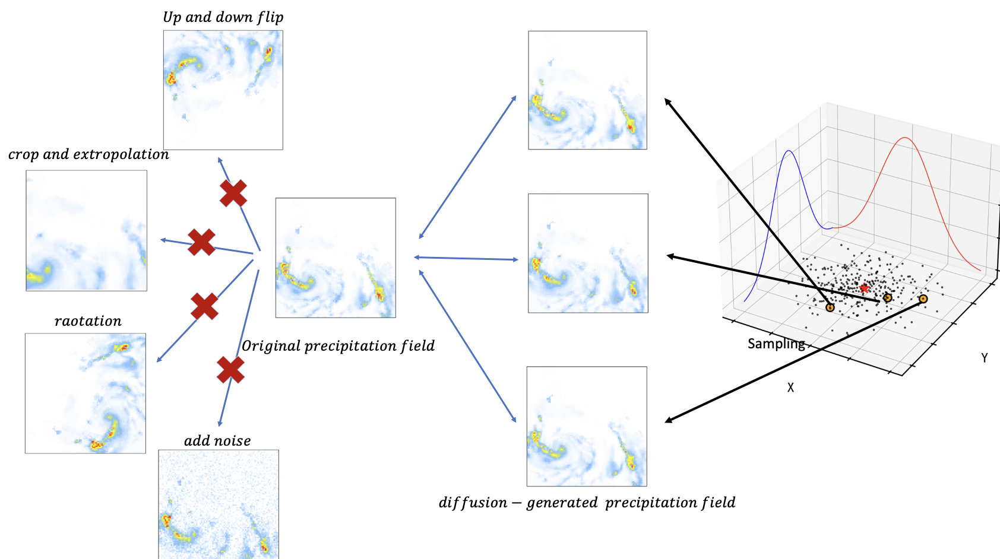
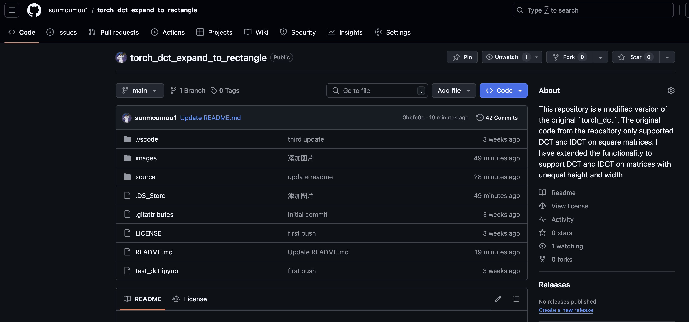

# Blogs

## Functional analysis[泛函分析]?
I am planning a special topic on functional analysis and its application in cutting-edge diffusion models. If you are interested, please contact me.

---
Let’s start by supplementing some content about real-valued functions. Note that these concepts are simplified compared to the real analysis courses typically offered to undergraduate mathematics students, as they are mainly aimed at researchers in machine learning.

[1. 实变函数：为什么需要勒贝格积分](https://obsius.site/0o5s281v5r5v4320144i)

[2. 实变函数：集合内容补充](https://shepherdchinacan.github.io/blogs/real_valued_function/2.集合内容补充)

[3. 实变函数：测度](https://shepherdchinacan.github.io/blogs/real_valued_function/3.测度)

[4. 实变函数：可测函数](https://shepherdchinacan.github.io/blogs/real_valued_function/4.可测函数)

---

## My first Paper in Preparation!

• Developed a method to increase the number of extreme rainfall events to enhance the training of predictive models.
    1. Successfully completed preliminary experimental tests validating the effectiveness of the algorithms.
    2. Currently in the writing phase, with plans to submit findings to journal before 2025.

## torch_dct_expand_to_rectangle

I recently encountered a challenge while training diffusion models, where I needed to mollify Gaussian noise. Initially, I explored the __torch_dct__ library but realized that it only supported DCT and IDCT on square matrices. However, my use case involved performing a DCT on a meteorological field (a rectangular field), where the longitudinal dimension is typically twice the length of the latitudinal direction. To address this problem, I extended the functionality to support DCT and IDCT on matrices with unequal height and width, allowing broader applicability in scenarios involving non-square matrices. This modification is now open-sourced on GitHub, and I welcome everyone to check it out and use it in their projects!

> LINK: https://github.com/sunmoumou1/torch_dct_expand_to_rectangle

## 大气动力学教程笔记
__下面整理了自己本科以及博士阶段整理的大气动力学相关的笔记，因为这些笔记的本质目的是记录下来常见的概念和结论以避免遗忘，因而很多时候并没有进行详细的推导__

[1. 流体运动基本方程](https://shepherdchinacan.github.io/blogs/atmosphere_dynamics/1. 流体运动基本方程)

 

## Leave a Message

 

 

 

