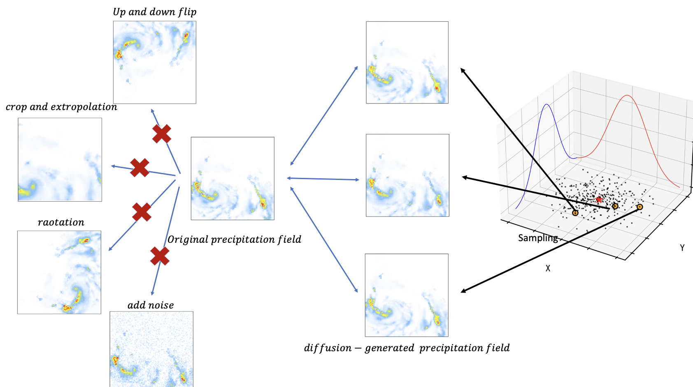

## Chinese Blogs

### NEWS
I am planning a special topic on functional analysis and its application in cutting-edge diffusion models. If you are interested, please contact me.

### My first Paper in Preparation!

• Developed a method to increase the number of extreme rainfall events to enhance the training of predictive models.

• Successfully completed preliminary experimental tests validating the effectiveness of the algorithms.

• Currently in the writing phase, with plans to submit findings to journal before 2025.

<!--  -->

 

## Leave a Message

 

 

 

