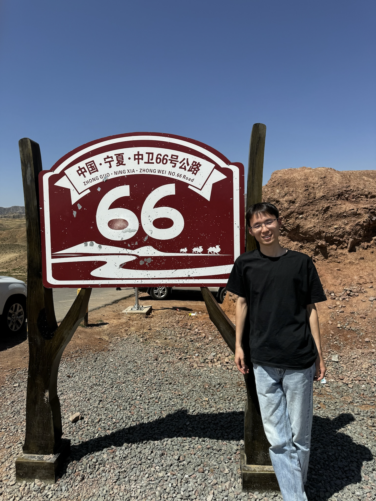

# About Me

Here is **Sun Sencan (孙森灿)**.

And I am a first-year doctoral student at Tsinghua University in China, with a background in Atmospheric Science. Currently, I am dedicating my research efforts towards exploring artificial intelligence methods for atmospheric circulation especially rainfall prediction.

If you are interested in any aspect of me, I would love to chat and collaborate, please email me at - ssc23@mails.tsinghua.edu.cn

## Academic Background

- **Sep 2023 - Future:** Department of Earth System Science, Tsinghua University
- **Sep 2019 - June 2023:** Atmospheric Science at the School of Atmospheric Sciences, Nanjing University

---

## Research Interests

- Diffusion models
- Weather predicting & Climate simulation

My research interests focus on AI generation algorithms, particularly **diffusion models**, and their applications in weather forecasting, climate simulation, and numerical model evaluation. I wish to devote my talent to this meaningful cause and bring well-being to society.

---

## Skills

### Artificial Intelligence

Since September 2022, I have been studying machine learning and have since delved into using deep learning techniques to tackle a series of scientific challenges in the field of meteorology. I am passionate about AI and hope to connect with more like-minded individuals.

### Meteorology

During my undergraduate studies, I took numerous courses in meteorology, such as dynamic meteorology, principles of meteorology, and climate dynamics, which provided me with a solid foundation in meteorology and even global climate change. Additionally, I have some experience in using atmospheric numerical models, although I may not focus on numerical meteorological models in the future.

### Technical writing

I enjoy writing about technical subjects and I feel I can do a pretty good job about it! My motivation is explaining things in simple and practical terms and thus making things easier for others. *In the future, I hope to write more popular science articles introducing topics such as PANGU, METNET, and Diffusion.*

