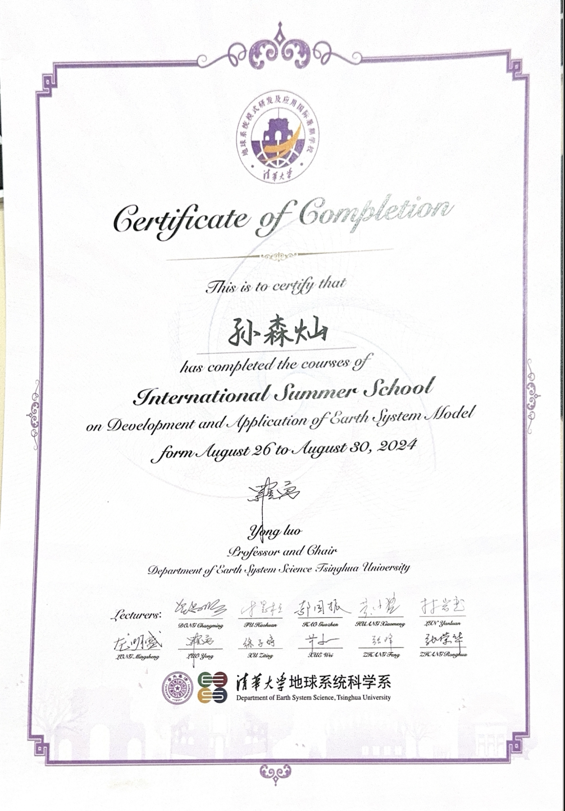

**Exciting things are always on the horizon!** I’m constantly exploring new ideas that have me fired up, and I can’t wait to share them with you soon. And let’s not forget the adventures life throws my way outside of work—who knows what surprises are next? Stay tuned for updates on upcoming events, discoveries, and maybe even a fun story or two!

Let me know if you’d like any tweaks!

----
# Lateeeeeest!

# Past
## 1. International Summer School on Development and Application of Earth System Model

- **time:** August 26 to August 30, 2024

- **location:** Tsinghua University

A huge thank you to all the amazing professors for their brilliant lectures! I’ve gained so much insight into the exciting ways **AI** is being applied in Earth sciences. Plus, this was my first time serving as a teaching assistant —what an experience! I learned a lot, had some fun, and it’s definitely a milestone I’ll never forget.

## Revolutionizing Weather Forecast & Climate Prediction Through Artificial Intelligence

- **time:** Sept 19 to Sept 21, 2024

- **Location:** IAS Lecture Theatre, HKUST (The Hong Kong Polytechnic University)

This September, I had the opportunity to be part of a groundbreaking AI event— this three-day symposium brought together leading experts from around the globe to discuss cutting-edge AI technologies and their transformative impact on atmospheric science.

From keynote lectures on climate modeling to AI in severe weather nowcasting, the event was packed with insights and exciting developments. Experts shared their research on neural weather models, AI-driven climate emulators, and innovative approaches to climate resilience.

Check out some snapshots from the event!  
  

---

---

 

## Leave a Message

 

 

 

